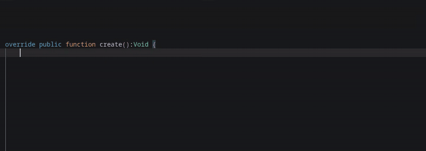

# FMOD for Haxe on HTML5, HashLink, Windows, Linux, and macOS

Having problems or want to chat? [Join the Haxe Discord](https://discordapp.com/invite/0uEuWH3spjck73Lo), then follow the [haxe-fmod thread](https://discord.com/channels/162395145352904705/1472372604433076446).

## Table of Contents

 - [Features](#features)
 - [Supported Platforms](#supported-platforms)
 - [Prerequisites](#prerequisites)
 - [How to Use This Library](#how-to-use-this-library)
 - [The API Layers](#the-api-layers)
 - [Selecting an FMOD Engine Version](#selecting-an-fmod-engine-version)
 - [HTML5 Builds](#html5-builds)
 - [FMOD Studio Project Configuration](#fmod-studio-project-configuration)
 - [Migrating From Previous haxe-fmod Versions?](#migrating-from-previous-haxe-fmod-versions)
 - [License](#license)
 - [Special Thanks](#special-thanks)
 - [Feature Requests and Contact](#feature-requests-and-contact)

## Features
- The full [FMOD Studio API](https://www.fmod.com/docs/2.03/api/studio-api.html) at runtime: events, buses, VCAs, snapshots, banks, global and labeled [parameters](https://www.fmod.com/docs/2.03/studio/parameters-reference.html), 3D/listeners, and profiling - with a friendly facade on top for the common cases
- Typed [callbacks](https://www.fmod.com/docs/2.03/api/studio-api-eventinstance.html#fmod_studio_event_callback_type) that carry their data: beats, timeline markers, and the playback lifecycle
- Refcounted bank loading with real unload and async loading
- HaxeFlixel components: one-call setup that routes the flixel sound tray and volume keys to FMOD, emitter and listener for positional audio, bank loader, and zone-based parameter triggers
- Programmer sounds for dialogue and other runtime-selected audio
- [Live Update](https://fmod.com/docs/2.03/studio/editing-during-live-update.html) for mixing sounds while playtesting (on by default in debug builds)
- Constants generated straight from your banks: the FMOD Studio export script rewrites the event/bus/VCA/parameter constants every time you build banks with `Ctrl+B`, so they always match your project

## Supported Platforms

| Platform | Architecture | Targets |
|----------|--------------|---------|
| HTML5 | All | WebAssembly |
| Windows | x86_64 | C++, HashLink |
| Linux | x86_64 | C++, HashLink |
| macOS | ARM64 (Apple Silicon) | C++, HashLink |

## Prerequisites

**FMOD Engine SDK** - Download version 2.03.12 from [fmod.com/download](https://www.fmod.com/download). See [How to Use This Library](#how-to-use-this-library) for setup instructions.

**C++ compiler** (C++ builds only) - `lime build mac`, `lime build windows`, and `lime build linux` require a C++ compiler. HashLink and HTML5 builds do not.

- **macOS**: Xcode Command Line Tools - install with `xcode-select --install`
- **Windows**: Build Tools for Visual Studio 2022 with the "Desktop development with C++" workload selected during installation. [Direct download](https://aka.ms/vs/17/release.ltsc.17.4/vs_buildtools.exe), or find the Fall 2022 LTSC build tools link [here](https://learn.microsoft.com/en-us/visualstudio/releases/2022/release-history#release-dates-and-build-numbers).
- **Linux**: `gcc` and `g++` (install via your package manager, e.g. `sudo apt install build-essential`)

## How to Use This Library

This library has been tested on games built with the `lime` and `openfl` CLI tools, and should work on any Haxe framework that utilizes the `Project.xml` file for builds.

See [haxe-fmod-test](https://github.com/Tanz0rz/haxe-fmod-test) for a working example of a HaxeFlixel game with this FMOD integration.

**1. Add the library to your Haxe project:**

[Download the package via Haxelib](https://lib.haxe.org/p/haxefmod)

If required, import the library in your project. On HaxeFlixel projects, add `<haxelib name="haxefmod" />` to the "Libraries" section of your `Project.xml` file.

**2. Download FMOD Studio and set up your project:**

This will be the tool you use to manage all audio for your game. Download FMOD Studio [here](https://fmod.com/download). Once installed, follow the [FMOD Studio Project Configuration](#fmod-studio-project-configuration) section before moving on.

**3. Set up the FMOD Engine SDK:**

This library requires you to supply your own FMOD Engine SDK (separate from FMOD Studio). The only officially supported version is 2.03.12. Download it from [fmod.com/download](https://www.fmod.com/download).

If you would like to use any other version of the FMOD Engine, see [Selecting an FMOD Engine Version](#selecting-an-fmod-engine-version).

**For C++ and HashLink builds**, set the `FMOD_SDK` environment variable to point to the FMOD Engine directory:

```bash
# For Linux/macOS
# in ~/.bashrc or ~/.zshrc
export FMOD_SDK="$HOME/fmod/fmodstudioapi20312" # (use $HOME, not ~)

# For Windows
# in the Environment Variables UI
# FMOD_SDK=C:\path\to\fmodstudioapi20312
```

**For HTML5 builds**, set a separate `FMOD_SDK_WEB` variable:

```bash
# For Linux/macOS
# in ~/.bashrc or ~/.zshrc
export FMOD_SDK_WEB="$HOME/fmod/fmodstudioapi20312html5" # (use $HOME, not ~)

# For Windows
# in the Environment Variables UI
# FMOD_SDK_WEB=C:\path\to\fmodstudioapi20312html5
```

This allows you to have both your C++/HashLink SDK and HTML5 SDK configured simultaneously.

**4. Check your setup:**

`haxelib run haxefmod check` will check various aspects of your local dev environment to verify your setup and is **highly recommended**.

**5. Use the library in code:**

The `FmodManager` class is the friendly way to interact with FMOD in your game: a background song slot plus fire-and-forget and handle-based sound effects. The `FmodEvents` constants used below are generated from your banks (see [FMOD Studio Project Configuration](#fmod-studio-project-configuration)). You can look through all of the available function calls with descriptions [here](https://github.com/Tanz0rz/haxe-fmod/blob/master/haxefmod/FmodManager.hx).

```haxe
public function StartLevel():Void {
    // One background song at a time. Transitions ride the authored fadeout
    FmodManager.PlaySong(FmodEvents.MusicMainLevel);
}

public function JumpPressed():Void {
    // Fire-and-forget playback
    FmodManager.PlaySoundOneShot(FmodEvents.SFXJump);
}

public function StartEngine():Void {
    // Handle-based playback for sounds you control over time
    engineSound = FmodManager.PlaySound(FmodEvents.SFXEngine);
    engineSound.setParameter("RPM", 0.2);
}

public function OnBeat():Void {
    // Typed callbacks with payloads
    FmodManager.OnSongEvent(data -> switch (data) {
        case TimelineBeat(bar, beat, _, _): pulseUI(bar, beat);
        default:
    });
}
```

Call `FmodManager.Update()` once per frame. HaxeFlixel games (flixel 5.9.0 or newer) can call `haxefmod.flixel.FmodFlxSetup.init()` once in their first state instead. It initializes FMOD, adds the `FmodFlxUpdater` plugin so Update runs every frame, and wires the flixel volume keys and sound tray to the FMOD master bus (with the tray's own beep silenced, since FMOD owns the audio now).

**6. Build and run:**

All targets work with standard lime commands:

```bash
lime test html5
lime test hl
lime test windows
lime test linux
lime test mac
```

**macOS note**: SDK libraries downloaded through a browser carry the quarantine attribute. FMOD signs its libraries so builds normally run without issue, but if macOS blocks the dylibs, clear the flag with `xattr -dr com.apple.quarantine "$FMOD_SDK"`.

## The API Layers

| Layer | Use it for |
|---|---|
| `FmodManager` + `FmodSound` | The common cases: one song, sound effects, bus volume/mute |
| `haxefmod.flixel.*` | HaxeFlixel components: `FmodFlxSetup`, `FmodFlxUpdater`, `FmodFlxUtilities`, `FmodFlxEmitter`, `FmodFlxListener`, `FmodFlxBankLoader`, `FmodFlxParameterTrigger` |
| `haxefmod.runtime.FmodRuntime` | Init settings, refcounted banks, 3D attachment, listeners |
| `haxefmod.studio.*` | The complete FMOD Studio API: `StudioSystem`, `EventDescription`, `EventInstance`, `Bus`, `Vca`, `Bank` |

```haxe
// Escape hatch example: everything FMOD Studio exposes is reachable
import haxefmod.studio.StudioSystem;

var music = StudioSystem.getBus("bus:/Music");
music.setVolume(0.5);

var description = StudioSystem.getEvent("event:/Ambience/Forest");
trace(description.getParameterDescriptionCount());
```

Initialization is settings-driven when you need it to be:

```haxe
FmodManager.Initialize({
    liveUpdate: true,        // defaults to true only in -debug builds
    numChannels: 256,
    bankFolder: "assets/audio",
    autoLoadBanks: ["Master.bank", "Master.strings.bank", "SFX.bank"],
});
```

**Compile-time defines** (set in `Project.xml` via `<haxedef name="..." value="..." />` or on the command line with `-D`):

| Define | Effect | Default |
|---|---|---|
| `haxefmod_num_channels` | Max virtual voices | 128 |
| `haxefmod_sample_rate` | Mixer sample rate | FMOD device default |
| `haxefmod_live_update` | Force Live Update on in any build | debug builds only |
| `haxefmod_no_live_update` | Force Live Update off in any build | |
| `haxefmod_bank_folder` | Folder the auto-loaded banks live in | `assets/fmod/Desktop` |
| `haxefmod_log_level` | FMOD debug logging: 0 none, 1 error, 2 warning, 3 log | 1 |

Runtime settings passed to `FmodManager.Initialize(...)` override the defines.

**HTML5 specifics**: initialization is asynchronous (see [HTML5 Builds](#html5-builds) for the loading-scene pattern). The FMOD web build ships FSB-only codecs, so loose wav/ogg loading and file-path programmer sounds are native-only (use audio table keys on HTML5). `Destroyed` callback events are not delivered on HTML5 (clean up in `release()`, which works on every target).

## Selecting an FMOD Engine Version

The officially supported FMOD Engine version is 2.03.12. Other versions **may work fine**, but I have not tested them.

Importantly, this library comes pre-bundled with HashLink binaries (hdlls) for FMOD Engine version 2.03.12.

If you use a different FMOD Engine version and want HashLink builds, you **must** compile the hdll for your platform from source against your installed version of the FMOD Engine:

```bash
# 1. Set FMOD_SDK to your version
export FMOD_SDK=/path/to/your/fmodstudioapi

# 2. Compile the hdll (from your project directory)
haxelib run haxefmod build-hdll

# 3. Build as normal
lime test hl
```

This requires a C compiler (`gcc` on Linux, `cc` on macOS, `cl` on Windows) and HashLink headers installed on your system.

The `build-hdll` command will auto-detect your platform, find HashLink headers in common locations, compile the hdll, and place it in a `.haxefmod/` directory in your project. If HashLink headers aren't found automatically, set `HASHLINK_DIR` to your HashLink installation directory.

### How the hdll is resolved

At build time, `lime test hl` uses a tiered fallback to find the right hdll:

1. **Project-local `.haxefmod/hlaxe_fmod.hdll`** - used if present (custom-compiled via `build-hdll`)
2. **Pre-built `<haxefmod_library_install_location>/templates/bin/hl/<Platform>/hlaxe_fmod.hdll`** - ships with the library (FMOD Engine 2.03.12)

The build log will tell you which one was used.

C++ and HTML5 targets do not rely on the hdll and will work with any FMOD version (although they will warn if you use anything other than 2.03.12).

## HTML5 Builds

For HTML5 builds to work, a dedicated scene must be run before the game starts to give the FMOD Engine a chance to fully load. See the [example project](https://github.com/Tanz0rz/haxe-fmod-test) for a demonstration of how to handle this. The `Main.hx` file loads the startup scene, the startup scene initializes FMOD and waits for it to report back as initialized, then the game is started.

## FMOD Studio Project Configuration

### FMOD Studio Live Update

One of the most powerful features of the FMOD ecosystem. Mix your sounds in real-time by binding FMOD Studio to a running instance of your game.

Live Update **only works on C++ and HashLink builds**. HTML5 builds will not work. The FMOD team said this is a limitation caused by running games inside web browsers and they have no plans to support this.

**Note**: On macOS and Windows, you may see a firewall dialog asking to allow incoming network connections when running your game with Live Update active. Live Update opens a local network socket (port 9264) so FMOD Studio can connect to your game for real-time audio mixing.

### Generating Constants From Your Banks

The [export script](fmod-scripts/ExportHaxeConstants.js) builds a list of everything in your banks that you can autocomplete in code. Press `Ctrl+B` in FMOD Studio and it writes the Haxe constants files **and** builds your banks in one step, so the constants always match what you just exported.



#### What gets generated

- `FmodEvents.hx`, `FmodBuses.hx`, `FmodVCAs.hx`, `FmodSnapshots.hx`, and `FmodParameters.hx`
- A `...Guids` class in each file with the same names mapped to GUIDs (kept out of the main class so autocomplete stays clean)
- `FmodEventEnum.hx` - a plain enum covering every event, for tool integrations (see [Event Enums](#event-enums))

Use the constants anywhere a path is expected:

```haxe
FmodManager.PlaySong(FmodEvents.MusicMainLevel);
FmodManager.PlaySoundOneShot(FmodEvents.SFXCoin);

var engine = FmodManager.PlaySound(FmodEvents.SFXEngine);
engine.setParameter("RPM", 0.5);
```

#### Setup

1. Copy [`fmod-scripts/ExportHaxeConstants.js`](fmod-scripts/ExportHaxeConstants.js) into your FMOD Studio scripts folder (`Scripts` next to your `.fspro`, or the global scripts directory from Preferences).
2. Reload scripts in FMOD Studio (Scripts menu) or restart Studio.
3. Press `Ctrl+B` (or Scripts -> Export Haxe Constants and Build) and pick your Haxe project's `source` folder once. The choice is cached next to the project.

From then on `Ctrl+B` regenerates the constants and builds banks in one keystroke.

#### Event Enums

If you are using a flow or tool that works better with enums, `FmodEventEnum.hx` holds enum representations of all sounds with additional helper functions that map them back to the path and GUID strings.

#### Auto-imports

To make the generated classes and the library available everywhere without per-file imports, create an `import.hx` next to your game's `Main.hx`. Wrap the imports in `#if !macro`: the FMOD classes use build macros and importing them inside the macro context breaks compilation.

```haxe
#if !macro
import haxefmod.FmodManager;
import FmodEvents;
#end
```

**Note:** for the generated files to stay up to date, you must run the export **every** time you build your sound bank (the script builds the banks for you, so `Ctrl+B` does both in one press).

## Migrating From Previous haxe-fmod Versions?

See [MIGRATION.md](MIGRATION.md) for the complete mapping.

## License

[MIT](https://en.wikipedia.org/wiki/MIT_License)

## Special Thanks

This entire project was started as an expansion of Aaron Shea's [faxe](https://github.com/ashea-code/faxe).

## Feature Requests and Contact

If you have any feature requests or are having issues using the library, please do one (or both) of the following:

- [Join the Haxe Discord](https://discordapp.com/invite/0uEuWH3spjck73Lo), then ask any questions you have in the [haxe-fmod thread](https://discord.com/channels/162395145352904705/1472372604433076446). Responses will be quick!

- [Open an Issue](https://github.com/Tanz0rz/haxe-fmod/issues) here on GitHub.