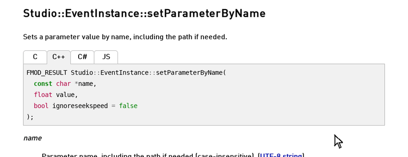

# FMOD docs extension

The haxefmod for FMOD docs browser extension adds a **Haxe** tab beside C, C++, C#, and JS on every function of the [FMOD API reference](https://www.fmod.com/docs/2.03/api/welcome.html). The tab shows the haxefmod method that wraps the function and its Haxe signature. Type definitions show the Haxe declaration, and guide examples show the Haxe version. Functions haxefmod does not expose say so and give the reason.

FMOD's own reference stays the place to read what a function does. The tab only adds the Haxe side.

## Install

- Chrome, Edge, Brave, and Opera: install from the Chrome Web Store (listing pending).
- Firefox: install from addons.mozilla.org (listing pending).
- Any browser with a userscript manager, such as Tampermonkey or Violentmonkey: install [`haxefmod-fmod-docs.user.js`](https://github.com/Tanz0rz/haxe-fmod/raw/master/extension/haxefmod-fmod-docs.user.js). The manager offers the install when the file opens.

Until the store listings are live, the userscript is the quickest route in every browser.

## Load unpacked

You can load the extension straight from a checkout of the repository.

Chromium browsers:

1. Open `chrome://extensions`.
2. Turn on Developer mode.
3. Choose "Load unpacked" and pick the `extension` directory.

Firefox needs its own manifest:

1. Run `python3 extension/package.py --unpacked`.
2. Open `about:debugging#/runtime/this-firefox`.
3. Choose "Load Temporary Add-on" and pick `extension/dist/firefox/manifest.json`.

## Privacy

The extension runs only on fmod.com documentation pages, asks for no other permissions, and makes no network requests. The data ships inside the package.
